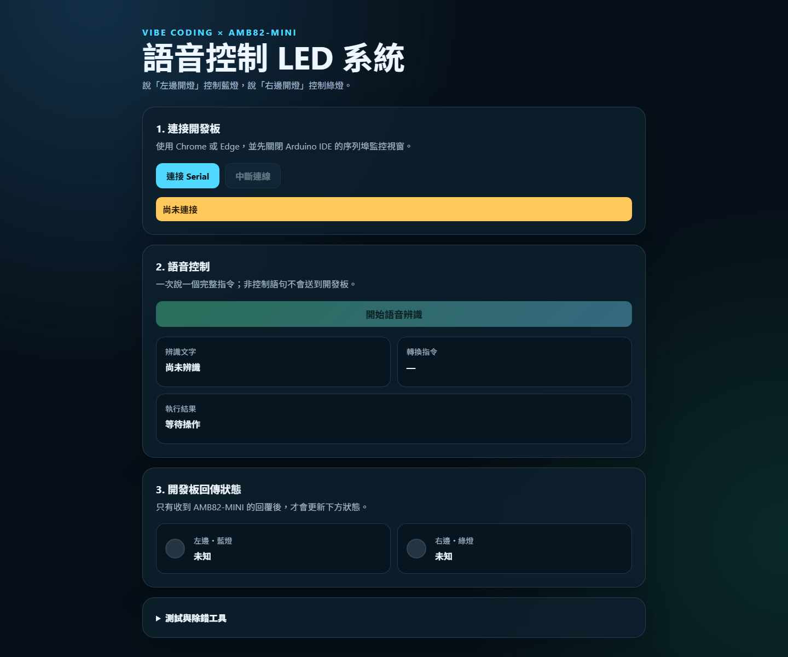

# Ameba Mini 語音控制 LED 系統

以 Vibe Coding 方式開發的 AMB82-MINI／RTL8735B 語音控制 LED 專題。可用電腦瀏覽器語音辨識，或用 iPad 鍵盤聽寫；控制指令最後都透過 USB Serial 傳給開發板。



## 作業需求對照

| 作業要求 | 本專題實作 |
|---|---|
| 語音輸入與辨識 | iPad Safari／桌面 Chrome、Edge 的 Web Speech API |
| 左、右 LED 控制 | 「左邊開燈」控制藍燈；「右邊開燈」控制綠燈 |
| 指令傳輸 | 網頁 → Python 橋接 → USB Serial → AMB82-MINI |
| 操作回饋 | 顯示辨識文字、傳送指令、板端 ACK 與 LED 回傳狀態 |
| 異常處理 | 非控制語句不傳送；斷線及逾時會顯示錯誤 |
| 加分功能 | 閃爍三次、中英文指令、語音回覆、自訂介面 |

## 專案內容

- `ameba/led_test/led_test.ino`：第一階段 LED 腳位與極性測試。
- `ameba/voice_led_controller/voice_led_controller.ino`：完整板端控制程式。
- `web/`：語音辨識、Serial 通訊、執行回饋與錯誤提示介面。
- `tablet/`：iPad 聽寫介面與電腦 Serial 橋接服務。
- `docs/system_architecture.md`：系統架構圖與設計說明。
- `docs/acceptance_test_record.csv`：五次左右指令、異常語句與斷線測試紀錄表。
- `docs/vibe_coding_log.md`：AI 協作與實測修正紀錄。

## 執行環境

- 開發板：Realtek AMB82-MINI（RTL8735B）
- Arduino IDE：2.3.10
- Realtek AmebaPro2 板卡核心：4.1.0，板型 `AMB82-MINI`
- 瀏覽器：桌面版 Google Chrome 或 Microsoft Edge
- Python：3.12（執行 iPad 網頁與 USB Serial 橋接服務）
- iPad：Safari，允許網頁使用麥克風與語音辨識
- Tailscale：Windows 版 1.102.4 與 iPad App，兩端登入同一個私人網路
- Serial 鮑率：115200

## iPad 使用步驟（電腦沒有麥克風時）

1. AMB82-MINI 保持用 USB 接在電腦，並確認電腦與 iPad 的 Tailscale 都已連線。
2. 關閉 Arduino IDE 的 Serial Monitor，並中斷電腦網頁的 Web Serial，避免 COM 埠被占用。
3. 在 PowerShell 執行：

   ```powershell
   powershell -ExecutionPolicy Bypass -File .\tablet\start_tablet.ps1
   ```

4. 若 Windows 防火牆詢問，僅允許「私人網路」。
5. PowerShell 會顯示 `iPad: http://電腦IP:8765`；在 iPad Safari 開啟該網址。
6. 按網頁的「開始語音辨識」，允許權限後說「左邊開燈」或「右邊開燈」。
7. 網頁會顯示辨識文字並自動送出；確認實體 LED 與板端回傳狀態一致。

## 跨實驗室固定網址展示

第一次設定完成 Tailscale 後，上課展示只需：

1. 電腦與 iPad 開啟 Tailscale，並登入同一個私人網路帳號。
2. AMB82-MINI 用 USB 接上電腦，確認沒有開啟 Serial Monitor 或 Web Serial。
3. 雙擊 `tablet/START_DEMO.cmd`，允許 Windows 權限提示。
4. iPad Safari 開啟畫面顯示的固定 `https://...ts.net` 網址。
5. 展示結束後雙擊 `tablet/STOP_DEMO.cmd`。

此模式不要求電腦與 iPad 位於同一個實驗室或同一個 Wi-Fi，但兩台裝置都必須能連上網路及 Tailscale。
啟動程式會自動偵測 COM 埠；若電腦同時有多個非 COM4 的連接埠，畫面會要求輸入 AMB82-MINI 使用的 COM 編號。

## 換一台 Windows 電腦展示

AMB82-MINI 的韌體會保留在板上，正常情況只要插上 USB 並按 RESET，不必重新上傳 `.ino`。新電腦第一次使用時需要：

1. 下載本專案，安裝 Python 3.12 與 Tailscale。
2. 在專案資料夾執行 `py -m pip install -r .\tablet\requirements.txt`。
3. 電腦與 iPad 的 Tailscale 登入同一帳號。
4. 插入 AMB82-MINI，雙擊 `tablet/START_DEMO.cmd`。
5. 若 Windows 沒有出現 COM 埠，再安裝 Arduino IDE、AmebaPro2 板卡套件或相應 USB 驅動。

Arduino IDE 只在需要重新燒錄韌體或排除驅動問題時使用，平常 Demo 不必開啟。

## 電腦版使用步驟

1. LED 測試已確認 `LED_ON = HIGH`、`LED_OFF = LOW`。
2. 使用 Arduino IDE 將 `voice_led_controller.ino` 上傳到 AMB82-MINI。
3. 關閉 Arduino IDE 的 Serial Monitor，避免連接埠被占用。
4. 在 PowerShell 執行：

   ```powershell
   powershell -ExecutionPolicy Bypass -File .\web\start_web.ps1
   ```

5. 使用 Chrome 或 Edge 開啟 `http://localhost:8000`。
6. 按「連接 Serial」並選擇 AMB82-MINI 的連接埠。
7. 允許麥克風權限，按「開始語音辨識」後說「左邊開燈」或「右邊開燈」。

## 指令與回覆協定

| 中文語音 | Serial 指令 | 板端動作 |
|---|---|---|
| 左邊開燈 | `LEFT_ON` | 藍燈亮、綠燈滅 |
| 右邊開燈 | `RIGHT_ON` | 藍燈滅、綠燈亮 |
| 閃爍三次 | `BLINK_3` | 藍燈與綠燈同時閃三次，再恢復原狀 |

## 加分功能

- 閃爍三次：中文說「閃爍三次」，或英文說 “blink three times”。
- 中英文指令：介面可切換 `中文（繁體）` 與 `English (US)`。
- 語音回覆：執行成功、非控制指令或通訊失敗後，由 iPad 朗讀結果。
- 自訂控制介面：顯示辨識文字、轉換指令、板端 ACK、LED 實際輸出狀態與事件紀錄。

成功回覆範例：

```text
ACK|LEFT_ON|BLUE=1|GREEN=0
```

未知指令回覆範例：

```text
ERR|UNKNOWN_COMMAND|BLUE=1|GREEN=0
```

## 異常處理

- 非控制語句：不傳送 Serial 指令，LED 狀態不改變。
- 未連接開發板：顯示通訊失敗，不假裝執行成功。
- 2.5 秒內未收到板端回覆：顯示逾時，畫面不更新 LED 狀態。
- USB 拔除：顯示通訊中斷，LED 狀態改為未知。

## 已完成的實機驗證

- 2026-09-30：`led_test` 以 AMB82-MINI／COM4 編譯及上傳成功。
- 藍燈與綠燈依序亮滅正常，確認 `HIGH = 亮`、`LOW = 滅`。
- 初次上傳曾出現 `Uart boot fail`；手動進入 UART Download 模式後成功。
- `voice_led_controller` 已上傳成功；以 Serial Monitor 傳送 `LEFT_ON` 與 `RIGHT_ON`，藍燈及綠燈切換正常。
- 電腦版網頁已透過 Web Serial 控制左右 LED，並顯示開發板回傳狀態。
- iPad 已透過固定私人 HTTPS 網址完成直接語音辨識；辨識「左邊開燈」與「右邊開燈」後自動控制成功。
- 非控制語句「不要開燈」不會送到開發板，LED 狀態保持不變。

## 尚未完成的實機工作

- 完成左右語音各剩餘四次及一次通訊中斷的驗收紀錄。
- 填寫 `docs/acceptance_test_record.csv`。
- 補上 YouTube 示範影片與 GitHub 專案連結後製作最後 PDF。
