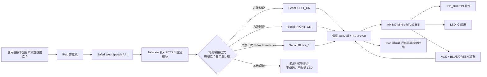

# 系統架構

## 設計重點

- 語音辨識由 iPad Safari 的 Web Speech API 完成，辨識欄位為唯讀且辨識後自動送出；AMB82-MINI 只負責接收指令與控制 LED。
- iPad 與電腦透過 Tailscale 私人 HTTPS 連線，不必位於同一個 Wi-Fi；電腦橋接程式會偵測並獨占 AMB82-MINI 的 COM 埠。
- 通訊方式為 USB Serial，鮑率固定為 115200。
- 電腦橋接程式只接受白名單中的完整語句，避免非控制語句誤觸 LED。
- iPad 頁面收到開發板的 `ACK` 後才更新 LED 狀態。
- LED 狀態代表開發板回報的輸出邏輯狀態，不是額外感測器量測到的光線。
- 加分功能包含兩顆 LED 閃爍三次、中英文語音辨識、iPad 語音回覆及自訂介面。
